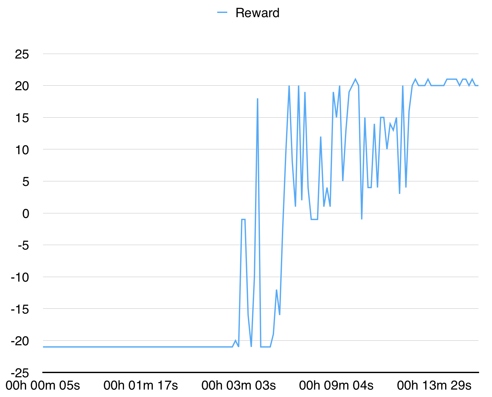

# pytorch-a3c

This is a PyTorch implementation of Asynchronous Advantage Actor Critic (A3C) from ["Asynchronous Methods for Deep Reinforcement Learning"](https://arxiv.org/pdf/1602.01783v1.pdf).

This implementation is inspired by [Universe Starter Agent](https://github.com/openai/universe-starter-agent).
In contrast to the starter agent, it uses an optimizer with shared statistics as in the original paper.

## A2C

I highly recommend to check a sychronous version and other algorithms: [pytorch-a2c-ppo-acktr](https://github.com/ikostrikov/pytorch-a2c-ppo-acktr).

In my experience, A2C works better than A3C and ACKTR is better then both of them. Moreover, PPO is a great algorithm for continuous control. Thus, I recommend to try A2C/PPO/ACKTR first and use A3C only if you need it specifically for some reasons.

## Contributions

Contributions are very welcome. If you know how to make this code better, don't hesitate to send a pull request.

## Usage
```
OMP_NUM_THREADS=1 python main.py --env-name "PongDeterministic-v4" --num-processes 16
```

This code runs evaluation in a separate thread in addition to 16 processes.

## Results

With 16 processes it converges for PongDeterministic-v4 in 15 minutes.


For BreakoutDeterministic-v4 it takes more than several hours.
